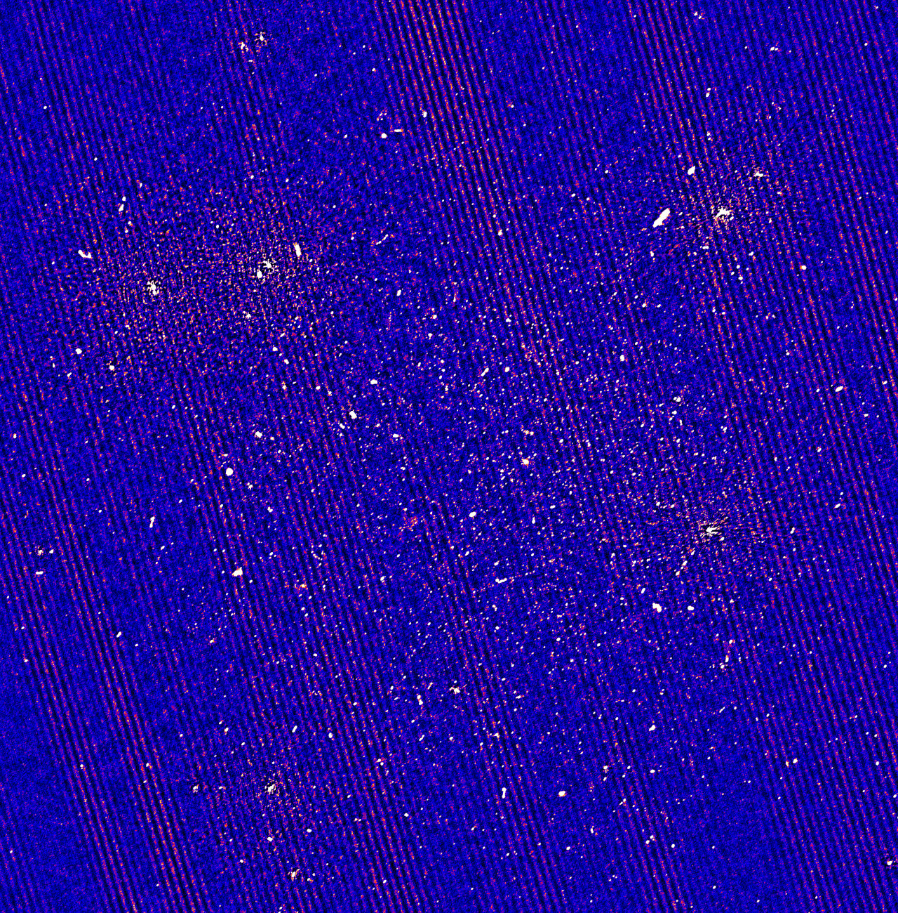

# barber

Barber removes fringes in a jiffy. 

| Before    | After |
| -------- | ------- |
|   |  |

Worlds stupidest tool. Just finds the largest visibility and reports stuff for you. 

## Install

Then make sure python3-casacore is installed.

    sudo aptitude install python3-casacore

Just clone this repository:

    git clone https://github.com/tmolteno/barber.git

Then run barber

    python3 barber.py --ms myms.ms

## Usage

    usage: barber.py [-h] --ms MS [--field FIELD] [--debug] [--version]

    Barber: It will remove your fringe in a jiffy.

    options:
        -h, --help     show this help message and exit
        --ms MS        The source measurement set. (default: None)
        --field FIELD  Use this FIELD_ID from the measurement set. (default: 0)
        --pol POL      Specify the polarization (-1 means all) (default: None)
        --version      Display the current version (default: False)
        --debug        Display debugging information (default: False)

## Typical Output

    python3 barber.py --debug --ms ~/astro/G330_HI.avg.ms

Produces the following:
    
    Max Vis Report
        Max Vis = 51.13466262817383
        at vis_index = 782935
        at channel_index = 7
        at pol_index = 1
        vis percentiles (n=786656):
            5%= 0.00
            50%= 0.00
            95%= 4.27
            99%= 9.68
        ANT1 = 0
        ANT2 = 1
        u = 15.112909948080528
        v = -7.147240629653197
        w = -24.01213549505843

This shows that the 99th percentile of visibilitiy magnitudes is 9.68 in this data, the maximum is 51.13. So could well be an outliner. This occured at time index 782935 in the data, on channel 7 at polarization_index 1.

The u,v,w show that this was a really short baseline, between antenna index 0, and 1.

Note: All indexes are zero based.

## Credits

Thanks to Kenda for inspiring this silly tool.

## TODO

* Use dask so that the ms doesn't have to fit in memory at all.
* an analyzer that takes the image and reports the offending baseline.

## Changelog

- 0.1.0a1 First test release
